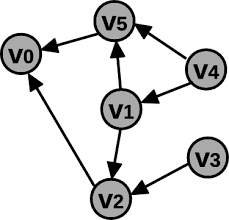

## :family_man_woman_girl_boy: Equipe
:man_teacher: Professor: [Kennedy Reurison Lopes](https://github.com/kennedyufersa). 
:man_student: Integrante: [Arthur Kellyson Pinheiro de Negreiros](https://github.com/Arthurkellysonp).  
:woman_student: Integrante: [Geísa Morais Gabriel](https://github.com/Geisa-mg). 
:man_student: Integrante: [Leonardo Inácio Guilherme Dantas](https://github.com/LeonardoIGD). 
:woman_student: Integrante: [Lívia Beatriz Maia de Lima](https://github.com/liviabeatrizml). 
:man_student: Integrante: [Pedro Makson Fontes da Costa](https://github.com/PedroMakson).

## Grafos
> O conceito de grafos refere-se às relações entre os objetos de um conjunto, isto é, um conjunto de vértices interconectados dois a dois por arestas. Assim sendo, essas estruturas podem ser representadas por G(V, E), em que V são os vértices e E as arestas do grafo. Nesse sentido, podemos exemplificar um grafo qualquer como G(6, 7), onde 6 é o número de vértices e 7 o número de arestas.

Baseado no estudo dos Grafos, diante das aulas teóricas em sala de aula, foi possível desenvolver o código em questão com a linguagem C++.

 -  Alteração no código pré-determinado pelo professor
	-   Arquivos não alterados
	    -   cidade.cpp - Não alteramos nada nesse arquivo para mantermos a mesma estrutura dada pelo professor.
	-   Arquivos alterados
		-   bancoDeDados - Organizamos um banco de dados contendo as informações das cidades;
		-   lerArquivos.cpp - XXX;
		-   Grafo.cpp - Criamos funções para a aplicação do método de grafo, diante da matriz adjacente;
		-   main.cpp - Modificamos o arquivo para apresentar e organizar corretamente as ideias.

