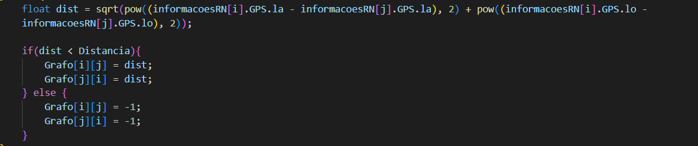

## :family_man_woman_girl_boy: Equipe
:man_teacher: Professor: [Kennedy Reurison Lopes](https://github.com/kennedyufersa). 
:man_student: Integrante: [Arthur Kellyson Pinheiro de Negreiros](https://github.com/Arthurkellysonp).  
:woman_student: Integrante: [Geísa Morais Gabriel](https://github.com/Geisa-mg). 
:man_student: Integrante: [Leonardo Inácio Guilherme Dantas](https://github.com/LeonardoIGD). 
:woman_student: Integrante: [Lívia Beatriz Maia de Lima](https://github.com/liviabeatrizml). 
:man_student: Integrante: [Pedro Makson Fontes da Costa](https://github.com/PedroMakson).

## Grafos
> O conceito de grafos refere-se às relações entre os objetos de um conjunto, isto é, um conjunto de vértices interconectados dois a dois por arestas. Assim sendo, essas estruturas podem ser representadas por G(V, E), em que V são os vértices e E as arestas do grafo. Nesse sentido, podemos exemplificar um grafo qualquer como G(6, 7), onde 6 é o número de vértices e 7 o número de arestas.

Baseado no estudo dos Grafos, diante das aulas teóricas em sala de aula, foi possível desenvolver o código em questão com a linguagem C++. No conteúdo de Grafos para resolver essa questão iremos utilizar a matriz adjacência, matriz essa que irá dispor das cidades do RN com suas respectivas coordenadas.

 -  Alteração no código pré-determinado pelo professor
	-   Arquivos não alterados
	    -   cidade.cpp - Não alteramos nada nesse arquivo para mantermos a mesma estrutura utilizada no projeto [Hash](https://github.com/liviabeatrizml/hashTable_desEstruturados);
	    - lerArquivos.cpp - Não alteramos nada nesse arquivo para mantermos a mesma estrutura utilizada no projeto [Hash](https://github.com/liviabeatrizml/hashTable_desEstruturados).
	-   Arquivos alterados
		-   bancoDeDados - Organizamos um banco de dados contendo as informações das cidades;
		-   Grafo.cpp - Criamos funções para a aplicação do método de grafo, diante da matriz adjacência;
		-   main.cpp - Modificamos o arquivo para apresentar e organizar corretamente as ideias.

## Grafo.cpp
> No arquivo Grafo.cpp foi desenvolvido as funções desde a alocação na matriz quanto a comparação da distância entre as cidades do RN.

De início foi colocado as bibliotecas que iremos utilizar no decorrer do código, após isso é conectado o arquivo lerArquivos que tem como função as buscas e capturas de dados no banco de dados. Seguindo, temos a definição do tamanho e início do desenvolvimento das funções.

### float  **alocaMatriz()
A função do tipo float alocaMatriz, irá alocar memória dinamicamente na matriz com o "FOR" apresentado no código e por fim irá retornar a matriz por completo.

### dataItem*  RN()
Como o professor pediu para que seja pego as cidades do RN, é nessa estrutura que isso ocorre. Explicando um pouco o código, de início iremos pegar as cidades do RN e suas informações que estão no bancoDeDados.

### float  **criarGrafo()
Na função float criarGrafo, iremos criar o  grafo com a matriz estaticamente, no código é possível notar dois "for" e eles tem função de colocar um zero em toda a matriz.

### float**  calculaDistancia(float  **Grafo, dataItem*  informacoesRN, float  Distancia)
Para calcular a distância entre as cidades, criamos a função "calculaDistancia" do tipo float na qual seus parâmetros é: float Grafo, dataItem informacoesRN e por fim a distancia.
A função tem como objetivo, traçar as distância colocando diante do Grafo na matriz, nessa função também iremos colocar em ordem as cidades pela distância, isso no código é desenvolvido no "IF e ELSE".
Utilizamos a função float dist dada pelo professor, que tem como desenvolvimento o calculo da distância com base na latitude e longitude das duas cidades em questão.

De início declaramos as variáveis auxiliares, como i e j. Começamos o preenchimento da matriz onde fazemos a comparação e caso seja a mesma cidade é colocado o -1, dessa forma, não são vizinhas, caso isso não ocorra, a função desenvolve armazenando o valor da distância entre as cidades.

### void  printCidadeComMaisVizinhos(float  **Grafo, dataItem*  informacoesRN, float  Distancia)
Nessa função são repassados o grafo montado das cidades, as informações com os dados das cidades do RN e a distância entre elas. Através disso, é conferido para cada cidade aquela que possui maior quantidade de vizinhos. No final da função será expresso aquela em que a contagem tiver sido maior.

### void  printCidadeSemVizinhos(float  **Grafo, dataItem*  informacoesRN, float*  Distancias)
Nela é informado para cada cidade da matriz de grafos aquela que tiver uma quantidade de associações menor que zero, caso essa condição seja verdadeira será atribuído o valor zero para aquela cidade, o que se refere que o município em questão não possui vizinhos, caso contrário o valor atribuído será diferente de zero. Por fim, dentro de uma condicional, é expresso aquela cidade que não possui vizinhos, se houver. Caso a suposição for falsa, é exibido a mensagem “Nao ha cidades sem vizinha!!!”.

### void  printDistTodasVizinhas(dataItem*  informacoesRN) 
Adquire as informações referentes às cidades do RN expressas em “informaçõesRN” e realiza a contagem do tamanho dos elementos contidos na matriz. Logo após é calculado a distância de todas as cidades vizinhas e é efetuada uma expressão responsável por informar a distância necessária para que todas as cidades sejam vizinhas.

### void  printGrafoMatricial(float  **matriz)
Informa o grafo respectivo à matriz das cidades. Para isso é lido o tamanho “SIZE” relacionado ao número de cidades e por meio de um laço “for” é capturado todas as informações dos municípios a serem expressos na função “PrintGrafoMatricial” .

## main.cpp
> Utilizamos esse arquivo como uma interface do nosso código.

Inclui os dados do arquivo “Grafo.cpp” responsável por construir a matriz e insere a chamada da função para criar o grafo com as informações das cidades do RN. Nesse arquivo também encontram-se as chamadas das funções expressas em “Grafos.cpp” respectivo ao que se pede nas questões.
Assim, para cada item existe um laço atribuído para informar:
-  o GRAFO MATRICIAL das cidades vizinhas do RN com base na distância;
- A cidade do RN com mais vizinhas com base na distância;
- A cidade do RN que não tem nenhuma vizinha com base na distância;
- A menor distância para que todas as cidades sejam consideradas vizinhas.
